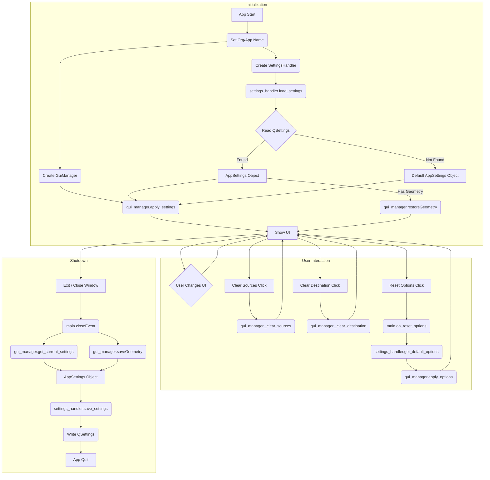

# Plan for Settings Persistence and UI Enhancements (v5)

## 1. Goal

Implement functionality to preserve user-selected options (sources, destination, rsync flags) and window geometry between application sessions. Provide controls to clear paths and reset options to defaults. Ensure the solution is robust, maintainable, and cross-platform.

## 2. Core Components & Approach

*   **Persistence:** Use PySide6's `QSettings` for cross-platform storage of application settings.
*   **Decoupling:** Introduce a data class (`AppSettings`) and a dedicated handler class (`SettingsHandler`) to separate data representation, persistence logic, and UI presentation.
*   **Window Geometry:** Include saving and restoring the main window's size and position.

## 3. New Components

### 3.1. `app_settings.py`

```python
# app_settings.py
from dataclasses import dataclass, field
from typing import List, Dict, Optional
from PySide6.QtCore import QByteArray # For geometry

@dataclass
class AppSettings:
    """Data class representing the application's configurable state."""
    sources: List[str] = field(default_factory=list)
    destination: str = ""
    rsync_options: Dict[str, bool] = field(default_factory=dict)
    window_geometry: Optional[QByteArray] = None # Store window size/pos
```

### 3.2. `settings_handler.py`

```python
# settings_handler.py
from PySide6.QtCore import QSettings, QByteArray
from typing import Dict, Optional
import logging # Optional: for error logging

from app_settings import AppSettings

# Define constants for QSettings keys
KEY_SOURCES = "sources"
KEY_DESTINATION = "destination"
KEY_OPTIONS_PREFIX = "options/" # Store options like options/archive=true
KEY_WINDOW_GEOMETRY = "windowGeometry"

class SettingsHandler:
    """Handles loading and saving application settings using QSettings."""

    def __init__(self, organization: str, application: str):
        self.settings = QSettings(organization, application)
        self._default_options = self._get_initial_default_options()

    def _get_initial_default_options(self) -> Dict[str, bool]:
        """Defines the hardcoded default rsync options."""
        # Match the initial defaults set in GuiManager._setup_ui
        return {
            "archive": True,
            "verbose": True,
            "compress": False,
            "human": True,
            "progress": True,
            "delete": False,
            "dry_run": False,
            "preserve_permissions": True,
        }

    def load_settings(self) -> AppSettings:
        """Loads settings from QSettings and returns an AppSettings object."""
        app_data = AppSettings()
        try:
            app_data.sources = self.settings.value(KEY_SOURCES, [])
            app_data.destination = self.settings.value(KEY_DESTINATION, "")
            app_data.window_geometry = self.settings.value(KEY_WINDOW_GEOMETRY) # Defaults to None if not found

            # Load options individually
            loaded_options = {}
            default_options = self.get_default_options()
            for key in default_options.keys():
                # Use default value if key not found in settings
                setting_key = f"{KEY_OPTIONS_PREFIX}{key}"
                default_val = default_options[key]
                # QSettings stores bools potentially as strings 'true'/'false'
                # or native bools depending on backend. value() handles this.
                # Provide the default bool directly.
                loaded_options[key] = self.settings.value(setting_key, default_val, type=bool)
            app_data.rsync_options = loaded_options

        except Exception as e:
            logging.error(f"Error loading settings: {e}")
            # Return defaults on error
            return AppSettings(rsync_options=self.get_default_options())

        return app_data

    def save_settings(self, app_data: AppSettings) -> None:
        """Saves the provided AppSettings object to QSettings."""
        try:
            self.settings.setValue(KEY_SOURCES, app_data.sources)
            self.settings.setValue(KEY_DESTINATION, app_data.destination)
            if app_data.window_geometry:
                self.settings.setValue(KEY_WINDOW_GEOMETRY, app_data.window_geometry)

            # Save options individually
            for key, value in app_data.rsync_options.items():
                self.settings.setValue(f"{KEY_OPTIONS_PREFIX}{key}", value)

            self.settings.sync() # Ensure changes are written
        except Exception as e:
            logging.error(f"Error saving settings: {e}")


    def get_default_options(self) -> Dict[str, bool]:
        """Returns the default rsync options."""
        # Return a copy to prevent modification
        return self._default_options.copy()

```

## 4. Modifications to Existing Files

### 4.1. `main_pyside.py` (Orchestration Logic)

*   **Import:** `AppSettings`, `SettingsHandler`, `QApplication`, `sys`.
*   **Constants:** Define `ORGANIZATION_NAME`, `APPLICATION_NAME`.
*   **Initialization:**
    *   `QApplication.setOrganizationName(ORGANIZATION_NAME)`
    *   `QApplication.setApplicationName(APPLICATION_NAME)`
    *   Create `app = QApplication(sys.argv)`
    *   Create `gui_manager = GuiManager()` (assuming GuiManager is the main window class or provides it)
    *   Create `settings_handler = SettingsHandler(ORGANIZATION_NAME, APPLICATION_NAME)`
*   **Load Settings:**
    *   `loaded_settings = settings_handler.load_settings()`
    *   `gui_manager.apply_settings(loaded_settings)`
    *   If `loaded_settings.window_geometry`: `gui_manager.restoreGeometry(loaded_settings.window_geometry)` (assuming `gui_manager` *is* the main window or has access to it).
*   **Save Settings (on exit):**
    *   Implement a `closeEvent` handler for the main window (or connect to `app.aboutToQuit`).
    *   Inside the handler:
        *   `current_settings = gui_manager.get_current_settings()`
        *   `current_settings.window_geometry = gui_manager.saveGeometry()`
        *   `settings_handler.save_settings(current_settings)`
*   **Connect Reset Options:**
    *   Connect `gui_manager.reset_options_button.clicked` to a new slot `on_reset_options`.
    *   `on_reset_options()`:
        *   `default_options = settings_handler.get_default_options()`
        *   `gui_manager.apply_options(default_options)` # Requires new apply_options method in GuiManager

### 4.2. `gui_manager.py`

*   **Imports:** `AppSettings`.
*   **UI Changes:**
    *   Add "Clear Sources" button to Source group.
    *   Add "Clear Destination" button to Destination group.
    *   Add "Reset Options" button to Options group.
*   **New Methods:**
    *   `apply_settings(self, settings: AppSettings)`: Updates source list, destination field, and all option checkboxes based on the `settings` object.
    *   `get_current_settings(self) -> AppSettings`: Creates and returns an `AppSettings` object populated with the current values from the UI widgets (sources, destination, options). Window geometry is handled by `main_pyside.py`.
    *   `apply_options(self, options: Dict[str, bool])`: Specifically updates the rsync option checkboxes based on the provided dictionary.
*   **New Slots:**
    *   `_clear_sources()`: Calls `self.source_list_widget.clear()`.
    *   `_clear_destination()`: Calls `self.destination_line_edit.clear()`.
*   **Connections:**
    *   Connect "Clear Sources" button to `_clear_sources`.
    *   Connect "Clear Destination" button to `_clear_destination`.
    *   Connect "Reset Options" button (this signal might need to be emitted *out* of GuiManager if orchestration happens in `main_pyside.py`, or connected directly if `SettingsHandler` is passed in). *Correction:* The connection should likely be made in `main_pyside.py` as described above.

## 5. Conceptual Flow Diagram



## 6. Benefits

*   **Improved User Experience:** Remembers user choices and window layout.
*   **Maintainability:** Clear separation of concerns (Data, Persistence, UI).
*   **Testability:** Components can be tested more independently.
*   **Cross-Platform:** Works seamlessly across Windows, Linux, and macOS.
*   **Robustness:** Includes basic error handling for settings operations.