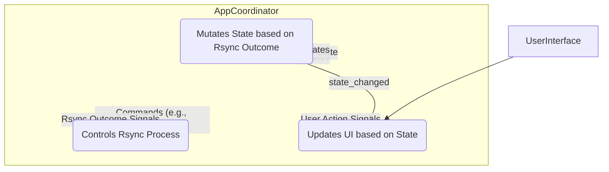

# Structural Refactoring Plan: Coordinator Approach

This plan outlines the steps to refactor the Copier application's structure to improve separation of concerns, enhance testability, and clarify data flow by introducing an `AppCoordinator` and centralizing state management.

**Concerns Addressed:**

*   Tight coupling between `RsyncController` and `GuiManager`.
*   Scattered application state across multiple components.
*   `RsyncController` having responsibilities beyond controlling the rsync process (e.g., managing overall application state).
*   Ensuring components adhere more closely to the Single Responsibility Principle (SRP).

**Core Components & Responsibilities:**

1.  **`AppState` (or Enhanced `StateManager`):**
    *   **Responsibility:** Acts as the single source of truth for *all* relevant application state (status enum, rsync availability, sources, destination, options, resume state, last error, etc.).
    *   **Interface:** Provides methods/properties to update state and emits a `state_changed` signal whenever the state is modified.

2.  **`RsyncController`:**
    *   **Responsibility:** Focuses *strictly* on managing the `RsyncRunner` lifecycle (starting, stopping, interrupting) and processing its output/results.
    *   **Dependencies:** Receives necessary *data* via method calls from the `AppCoordinator` when asked to perform an action (e.g., `start_rsync(sources, destination, options)`). Does *not* own or directly modify `AppState`.
    *   **Signals:** Emits signals indicating the progress and outcome of the rsync process (e.g., `rsync_started`, `rsync_progress_update`, `rsync_item_finished`, `rsync_finished_success`, `rsync_finished_error`, `rsync_interrupted`, `log_message`).

3.  **`GuiManager`:**
    *   **Responsibility:** Manages UI widgets, displays application state visually, and emits signals based on user interactions.
    *   **Dependencies:** Connects to the `AppState.state_changed` signal to receive state updates and refresh the UI accordingly (via a slot like `update_ui_from_state`).
    *   **Signals:** Emits signals for user actions (e.g., `run_clicked`, `interrupt_clicked`, `sources_dropped`, `destination_dropped`, `options_changed`).

4.  **`AppCoordinator` (New Class):**
    *   **Responsibility:** Orchestrates the entire application. Owns the core components and wires them together.
    *   **Owns:**
        *   The single `AppState` instance.
        *   The `GuiManager` instance.
        *   The `RsyncController` instance.
    *   **Logic & Connections:**
        *   Instantiates the owned components.
        *   Connects `GuiManager` user action signals to its own handler slots (e.g., `_handle_run_clicked`).
        *   Connects `RsyncController` outcome signals to its own handler slots (e.g., `_handle_rsync_finished`).
        *   Connects the `AppState.state_changed` signal to `GuiManager.update_ui_from_state`.
        *   **Handler Logic Examples:**
            *   `_handle_run_clicked`: Reads required info from `AppState`, checks if runnable, updates `AppState.status` to `RUNNING`, then calls `RsyncController.start_rsync(...)` with the necessary data.
            *   `_handle_destination_dropped(path)`: Updates `AppState.destination_path = path`, then updates `AppState.status` based on whether other conditions are met.
            *   `_handle_rsync_finished(success)`: Updates `AppState.status` to `FINISHED_SUCCESS` or `FINISHED_ERROR`.

**Data Flow Diagram:**

**Benefits:**

*   **Stronger SRP:** Clearer responsibilities for each component.
*   **Improved Encapsulation:** State is centralized and managed via the coordinator.
*   **Clearer Data Flow:** Interactions are orchestrated, reducing direct dependencies.
*   **Enhanced Testability:** Components can be tested more independently.